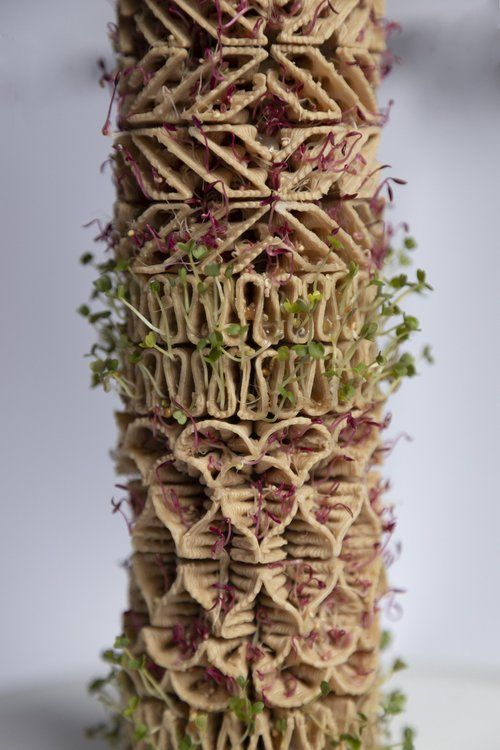
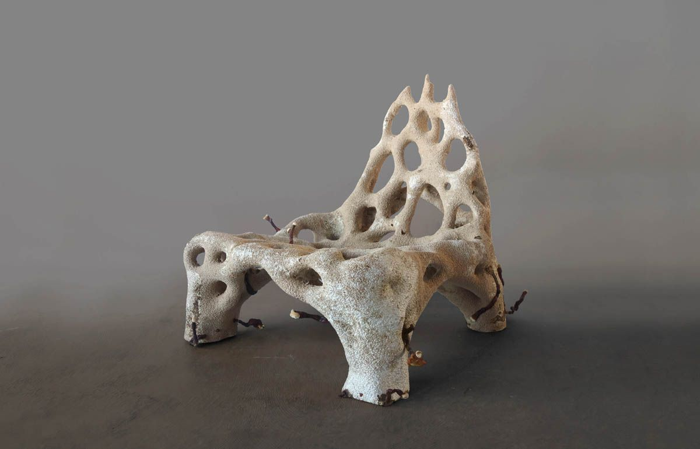

# Marcela González

## Perfil

**Disciplina / formación:** Arquitecta y fotógrafa
**Qué hago hoy:** Dirijo un estudio de diseño y fabricación, hacemos prototipos, mobiliario y museografía.
**Qué me gustaría aprender en este curso:** Formas de representación interactiva, reinterpretar datos de la naturaleza y el territorio.

## Intereses

- Oficios y fabricación digital
- Ecología y materiales biobasados
- Fotografía y video
- Café de especialidad

## Una pregunta que me interesa explorar

¿Cómo puede la tecnología asistir proceso biológicos en el diseño?.

## Algo que me inspira

## Links

- [Referencia 1](https://periscopioatelier.cl/)
- [Referencia 2](https://www.ecologicstudio.com/)

> No es necesario publicar información personal que no quieras compartir. Este README será parte de un repositorio público durante el laboratorio.
